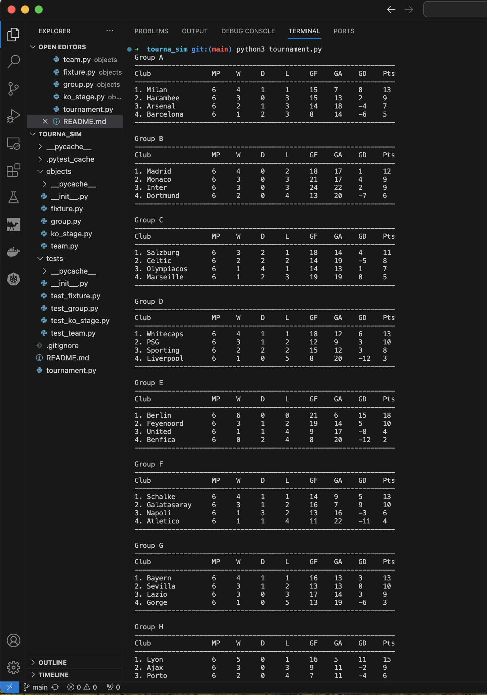
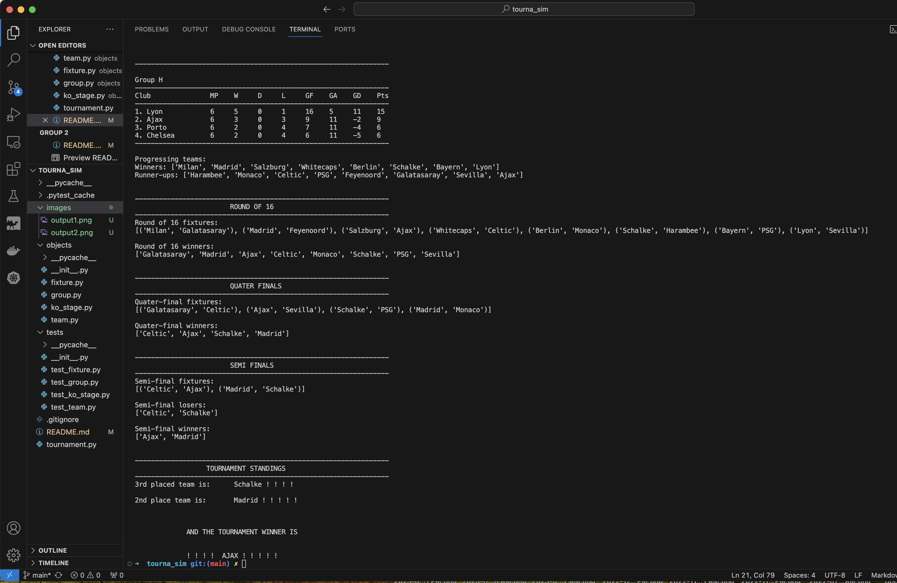

# Project Overview

The goal of this project was to create a soccer tournament simulator program to demonstrate OOP principles using Python. It is based off of the UEFA Champions League system.

## How to run

1. Clone repository to your local device
2. From the top directory, run
   > $ python3 tournament.py
3. Install Pytest if not already installed on your device.
4. From the top directory, run tests using `$ pytest` or `$ pytest -v` for a more verbose output.

## Conclusion

Demonstrated strong proficiency in Python, software architecture, and testing methodologies while creating a realistic simulation of soccer tournaments.

It would have been more succint to create this using the Java language.

## Sample Output

